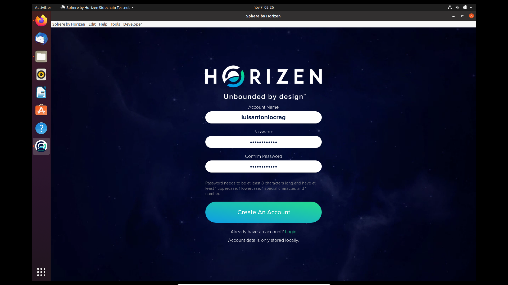
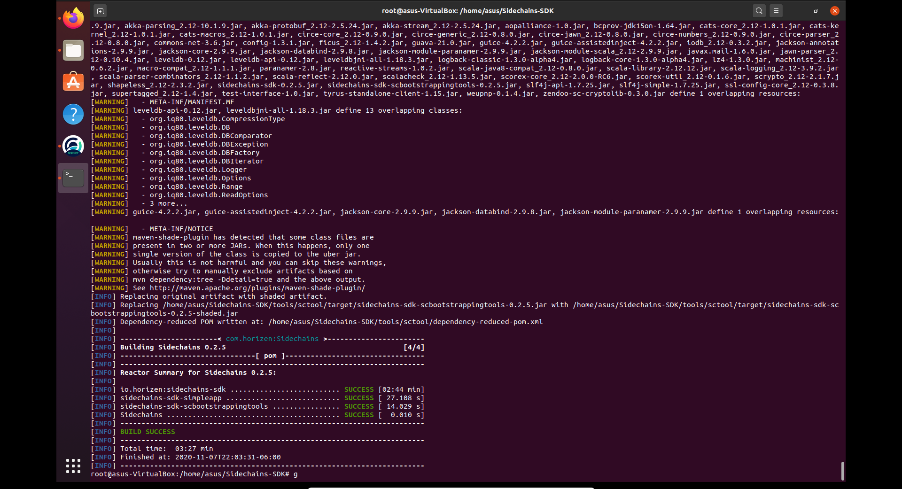
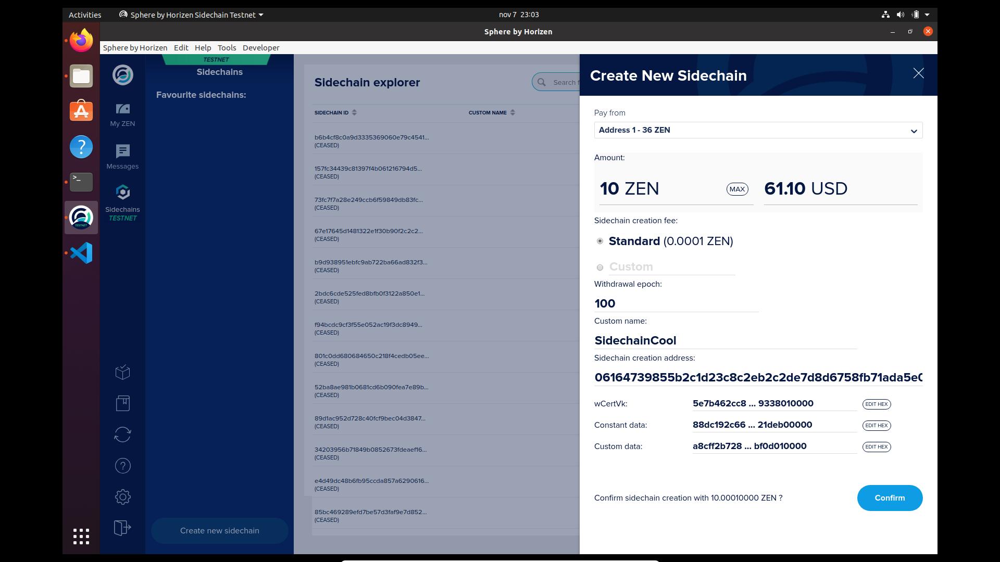
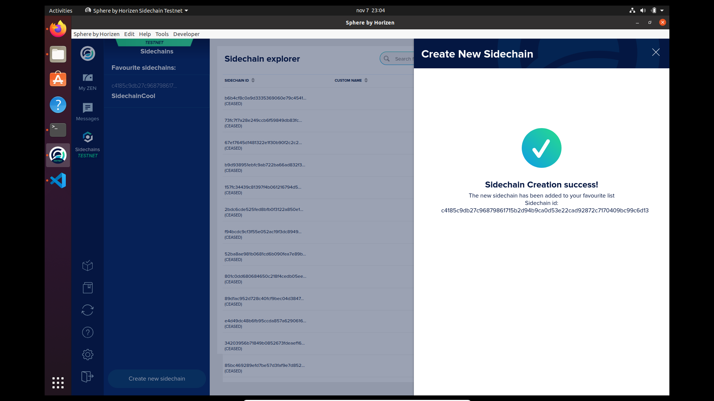
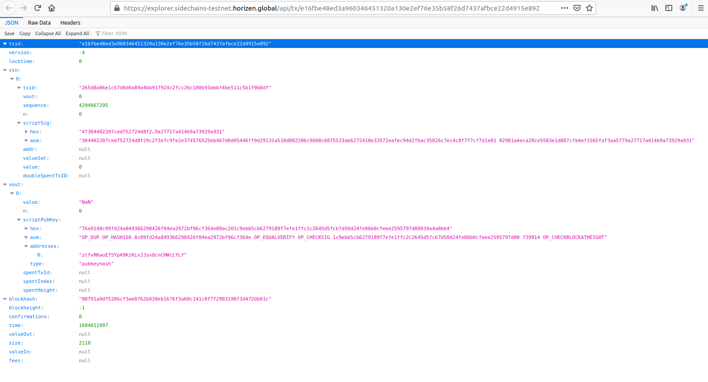
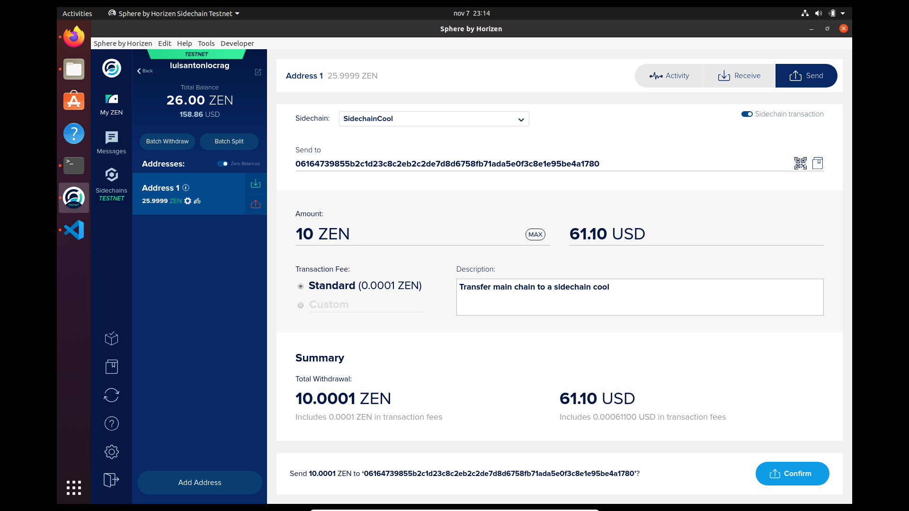
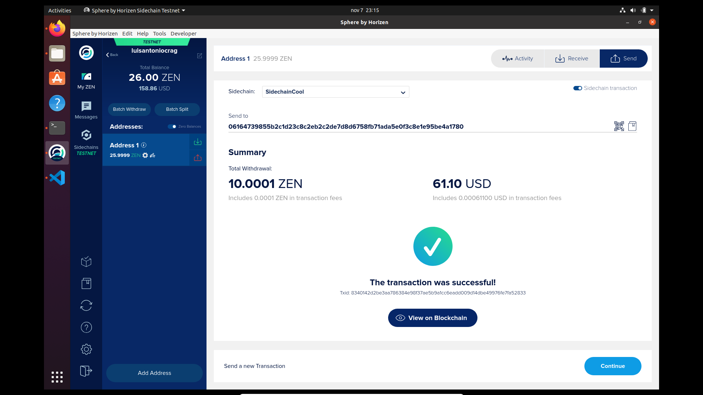
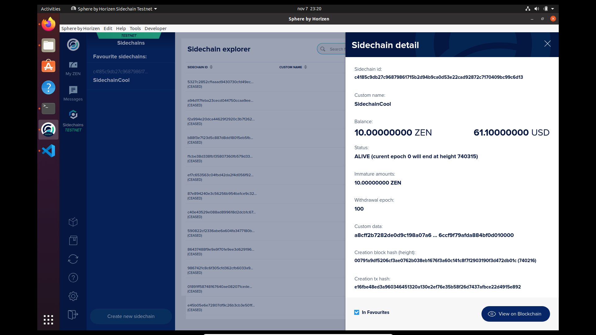

# Test Sidechain Functionalities With Sphere by Horizen

This is my report and compilation of necessary steps to test the functionalities of the sidechain and perform a forward transfer from the mainchain to the sidechain.

- **OS**: Ubuntu 20.04.1
- **Sphere By Horizen**: [v2.0.0](https://github.com/HorizenOfficial/Sphere_by_Horizen_Sidechain_Testnet/releases/download/desktop-v2.0.0-beta-sidechain-testnet/Sphere_by_Horizen_Sidechain_Testnet-2.0.0-beta.deb)

## Download & Install .deb - Auth 🔐

The truth is that this process was too easy. And the registration is intuitive.

I first created an account and then logged in.



## Wait for Sync 🕐


Once I log in, I have to wait for it to sync with the network.

This is a time consuming process.

**How viable would it be to create a fast captchup or maybe a lightweight node?**

I know it is not a safe option, but for entry developers and testing the technology would be a great advantage.
 
> I don't know if Horizen has already planned or has a built solution.

## While Creating an New Wallet

 

This process has very good UX.👌🏻

## Obtain free test ZEN (tZEN) 🤩

> Too bad they are only test coins.😓


## Installation requirements ...

```bash
$ sudo apt-get update
$ sudo apt-get install -y software-properties-common
$ wget -qO - https://adoptopenjdk.jfrog.io/adoptopenjdk/api/gpg/key/public | sudo apt-key add -
$ sudo add-apt-repository --yes https://adoptopenjdk.jfrog.io/adoptopenjdk/deb/
$ sudo apt-get update
$ sudo apt-get install adoptopenjdk-8-hotspot
$ sudo apt-get install maven
```

## Build Sidechains SDK

https://github.com/HorizenOfficial/Sidechains-SDK/tree/master/examples/simpleapp

```bash
$ git clone https://github.com/ZencashOfficial/Sidechains-SDK.git
$ pushd Sidechains-SDK
$ mvn package
```

In my case, JAVA was not configured correctly.

And I used the help of this short but great article 👍🏻: 
https://medium.com/@charinin/setting-java-home-environment-variable-in-ubuntu-e355c80e5b6c



Due to my environment configuration I had to go through the build process with administrator permissions.

## Bootstrapping 💻

I followed the recommended steps in:
https://github.com/HorizenOfficial/Sidechains-SDK/blob/master/examples/simpleapp/mc_sc_workflow_example.md

`java -jar tools/sctool/target/sidechains-sdk-scbootstrappingtools-0.2.5.jar`

And the responses in .json are stored in [this file](./simpleapp.response.jsonc).

Then go to Sphere by Horizen-2.0.0 again....

## Creating a New Sidechain 🔅

Got synced and now I can create a new sidechain on testnet.






I waited for my SidechainCool😎 to confirm and now if ... I did a forward transfer from main chain to side chain

## Forward Transfer from Main Chain to Side Chain 🤑



